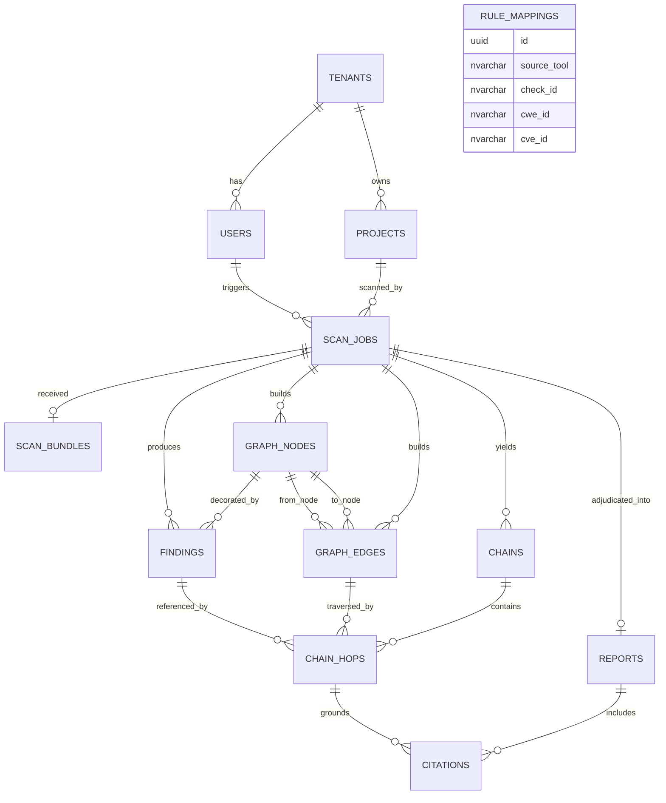

# SentinelAI — Database Design (DAD-01a)

*Cross-layer exploit-path reasoning for CI/CD security auditing*

**Sprint 0 Deliverable** · SentinelAI-Team · Graduate Capstone Project
Version 2.0 · Sprint 0 baseline (D2 architecture) · July 2026

---

## Document control

| Field | Detail |
|-------|--------|
| Project | SentinelAI — Automated Threat Modeling & SecOps Engine |
| Team | SentinelAI-Team (6 members) |
| Members | Mohamed Fathi Ibrahim, Mohamed Yasser Elsherbiny, Seif Eldin Medhat Farouk, George Mariey Demyan Beshara, Hana Mohamed Elsayeh, Mostafa Fouad Hendy |
| Sprint | Sprint 0 — Foundations, contracts & de-risk (Week 1) |
| Status | Baseline design, reflects the D2 distributed-scan architecture |
| Locked stack | C#/.NET · ASP.NET Core · Microsoft Agent Framework 1.0 · GPT-4o (Azure) / Claude (demo) · Qdrant · SQL Server · Angular · GitHub Actions + Docker |

> **What changed for D2.** The relational model now reflects the distributed-scan model: the backend receives a **bundle** (findings + infrastructure/manifest artifacts) from a GitHub Actions runner, never the application source. New columns capture the bundle's provenance (runner-side scan status, corpus version, join-confidence). The **rule-mapping table is now a first-class SQL Server table** (`rule_mappings`) rather than a static dictionary. Cross-layer edges carry a **confidence tier** so unresolved-but-load-bearing joins are recorded rather than silently dropped.

---

## 1. Purpose & scope

This document defines the relational data model (SQL Server) for SentinelAI, as fixed in Sprint 0 under the D2 architecture. The relational schema is the operational and audit-record store. It deliberately excludes the RAG knowledge corpus (Qdrant) and the benchmark corpus (a separate store), and it now **includes** the rule-mapping table as a proper relational table.

> **Boundary rule.** SQL Server stores who ran what, what was received, and what was found. It never stores the scanned application source (which never leaves the runner under D2) and never stores vector knowledge (that is Qdrant). The rule-mapping table lives here because it is an exact `check_id → CWE/CVE` lookup — deterministic relational data, never embedded.

---

## 2. The store boundary (four stores, one relational)

| Store | Technology | Holds | Embedded? |
|-------|-----------|-------|-----------|
| Relational | SQL Server | Tenants, users, projects, scan jobs, bundle provenance, findings, graph nodes/edges, chains, hops, reports, citations | No |
| Rule-mapping table | SQL Server table (`rule_mappings`) | Tool check_id → CWE/CVE | No |
| Vector (RAG) | Qdrant (offense/defense collections) | CVE / ATT&CK / CAPEC / OWASP knowledge chunks | Yes |
| Benchmark corpus | Separate store | TerraGoat, labeled C# fixtures — ground truth | No (never embedded) |

The first two rows both live in SQL Server; the design keeps them logically distinct because the rule-mapping table is reference data (rarely changes, shared across all tenants) while the rest is operational data (per-tenant, per-scan).

---

## 3. Entity-relationship model

### 3.1 Entities

| Entity | Represents | Key relationships |
|--------|-----------|-------------------|
| tenants | An organization / customer boundary | 1→N users, 1→N projects |
| users | A person within a tenant, with a role | N→1 tenant, 1→N scan_jobs (triggered) |
| projects | A registered repository | N→1 tenant, 1→N scan_jobs |
| scan_jobs | One scan run at PR time (central record) | N→1 project, N→1 user, 1→1 scan_bundle, 1→N findings, 1→N nodes, 1→N edges, 1→N chains, 1→1 report |
| scan_bundles | Provenance of the D2 bundle received from the runner | 1→1 scan_job |
| findings | One normalized scanner finding | N→1 scan_job, decorates a node, referenced by chain_hops |
| graph_nodes | A node in the resource graph (package, code unit, image, task, role, resource) | N→1 scan_job, 1→N edges (either end), decorated by findings |
| graph_edges | A relation between two nodes, with a confidence tier | N→1 scan_job, N→1 from-node, N→1 to-node |
| chains | An adjudicated exploit chain | N→1 scan_job, 1→N chain_hops |
| chain_hops | One hop of a chain (a finding + technique + edge) | N→1 chain, N→1 finding, N→1 edge, 1→N citations |
| reports | The prioritized draft audit | 1→1 scan_job, 1→N citations |
| citations | A link from a hop/report to a knowledge chunk | N→1 chain_hop, N→1 report |
| rule_mappings | Reference: tool check_id → CWE/CVE | Standalone lookup (not tenant-scoped) |

> **New under D2.** `scan_bundles` (bundle provenance), `graph_nodes` and `graph_edges` (the resource graph persisted for replay and UI rendering), and `rule_mappings` (the promoted lookup table) are the additions over the pre-D2 model.

### 3.2 Relationships (crow's-foot summary)

```
tenants     ||--o{ users
tenants     ||--o{ projects
users       ||--o{ scan_jobs        (triggered_by)
projects    ||--o{ scan_jobs        (scanned_by)
scan_jobs   ||--o| scan_bundles     (one received bundle per job)
scan_jobs   ||--o{ findings
scan_jobs   ||--o{ graph_nodes
scan_jobs   ||--o{ graph_edges
scan_jobs   ||--o{ chains
scan_jobs   ||--o| reports          (one draft audit per job)
graph_nodes ||--o{ findings         (a node is decorated by findings)
graph_nodes ||--o{ graph_edges      (as from-node)
graph_nodes ||--o{ graph_edges      (as to-node)
chains      ||--o{ chain_hops
findings    ||--o{ chain_hops       (a finding may appear in many hops)
graph_edges ||--o{ chain_hops       (a hop traverses one edge)
chain_hops  ||--o{ citations
reports     ||--o{ citations
```

`rule_mappings` stands alone — it is reference data consulted during the pipeline, not linked by foreign key to any tenant row.

The full ERD (mermaid) is in Appendix A.

---

## 4. Table definitions

Primary keys are UUIDs. Timestamps are UTC. Foreign keys enforce tenant scoping at the query layer; every read is filtered by the caller's tenant. `rule_mappings` is the one exception — it is global reference data.

### 4.1 tenants

| Column | Type | Notes |
|--------|------|-------|
| id | uuid PK | — |
| name | nvarchar | Organization name |
| plan_tier | nvarchar | Plan / entitlement tier |
| created_at | datetime2 | UTC |

### 4.2 users

| Column | Type | Notes |
|--------|------|-------|
| id | uuid PK | — |
| tenant_id | uuid FK | → tenants.id |
| email | nvarchar | Unique per tenant |
| role | nvarchar | RBAC role (admin / analyst / viewer) |
| created_at | datetime2 | UTC |

### 4.3 projects

| Column | Type | Notes |
|--------|------|-------|
| id | uuid PK | — |
| tenant_id | uuid FK | → tenants.id |
| repo_url | nvarchar | Registered repository |
| default_branch | nvarchar | e.g. main |
| github_installation_id | nvarchar | GitHub App install for PR comment posting, nullable |

### 4.4 scan_jobs

| Column | Type | Notes |
|--------|------|-------|
| id | uuid PK | — |
| project_id | uuid FK | → projects.id |
| triggered_by | uuid FK | → users.id, nullable (machine-token runs) |
| pr_ref | nvarchar | Pull-request ref |
| commit_sha | nvarchar | Scanned commit |
| status | nvarchar | queued / running / completed / failed |
| corpus_version | nvarchar | Corpus version retrieved against (same-model invariant boundary) |
| bundle_purged | bit | Proves the received bundle was deleted after audit |
| started_at | datetime2 | UTC |
| completed_at | datetime2 | UTC, nullable |

> Renamed from the pre-D2 `code_purged` to `bundle_purged`: under D2 there is no application source to purge — what is deleted is the received bundle (findings + infra/manifest artifacts).

### 4.5 scan_bundles (new)

Provenance of the bundle uploaded by the runner. One row per job; captures what the runner sent and whether its pre-scan ran, so the backend's trust assumptions are recorded.

| Column | Type | Notes |
|--------|------|-------|
| id | uuid PK | — |
| scan_job_id | uuid FK | → scan_jobs.id (1:1) |
| runner_secret_scan | nvarchar | Runner-side Gitleaks result: passed / findings / skipped / unknown |
| ingress_redaction_applied | bit | Backend ingress redaction ran before any LLM call |
| artifact_manifest | nvarchar(max) | JSON list of artifacts received (dot graph, tf source, dockerfile, manifests, sarif files) |
| scanner_versions | nvarchar(max) | JSON map of tool → version, for reproducibility/trust |
| received_at | datetime2 | UTC |

### 4.6 findings

| Column | Type | Notes |
|--------|------|-------|
| id | uuid PK | — |
| scan_job_id | uuid FK | → scan_jobs.id |
| source_tool | nvarchar | semgrep / roslyn / dependency-check / trivy / checkov |
| layer | nvarchar | code / dep / infra |
| severity | int | Normalized 0–4 scale |
| cwe_id | nvarchar | Linking key → RAG + graph, nullable |
| cve_id | nvarchar | Linking key → RAG + graph, nullable |
| node_ref | nvarchar | Canonical graph node it decorates (`type:identifier`) |
| message | nvarchar(max) | Human-readable; redacted; used to build the RAG query |
| redacted | bit | Ingress secret-redaction applied to this finding's text |

### 4.7 graph_nodes (new)

The resource graph is persisted so the audit is replayable and the UI can render the chain. One row per node.

| Column | Type | Notes |
|--------|------|-------|
| id | uuid PK | — |
| scan_job_id | uuid FK | → scan_jobs.id |
| node_key | nvarchar | Canonical `type:identifier` (e.g. `pkg:Newtonsoft.Json`, `iam_role:order`) |
| node_type | nvarchar | pkg / code / image / task / role / resource |
| layer | nvarchar | code / dep / infra |
| is_hot | bit | Seeded a chain (carries a high-severity finding) |
| attrs | nvarchar(max) | JSON of node attributes (version, resource address, etc.) |

Unique constraint on (`scan_job_id`, `node_key`) enforces the canonical-ID invariant within a job — a duplicate key would be the "per-layer island" bug surfacing.

### 4.8 graph_edges (new)

| Column | Type | Notes |
|--------|------|-------|
| id | uuid PK | — |
| scan_job_id | uuid FK | → scan_jobs.id |
| from_node_id | uuid FK | → graph_nodes.id |
| to_node_id | uuid FK | → graph_nodes.id |
| relation | nvarchar | used-by / built-into / deployed-as / assumes / can-access |
| seam | nvarchar | infra-spine / dep-code / code-infra / role-resource / transitive |
| confidence | nvarchar | certain / inferred / unresolved |
| oriented_attack_dir | bit | Edge re-oriented to attack direction (asserts the orientation guard) |

> **Confidence tier is first-class.** `certain` (explicit reference — spine, manifest, IAM parse), `inferred` (normalized image-name match), `unresolved` (a load-bearing join that could not be confirmed automatically). An `unresolved` edge is recorded, not dropped, so the debate can surface it as a "potential chain, unverified join" for human confirmation.

### 4.9 chains

| Column | Type | Notes |
|--------|------|-------|
| id | uuid PK | — |
| scan_job_id | uuid FK | → scan_jobs.id |
| hop_count | int | Number of hops (bounded 3–4) |
| priority | int | Rank by severity + exploitability |
| status | nvarchar | asserted / validated / rejected |
| min_confidence | nvarchar | Weakest edge confidence along the chain (certain / inferred / unresolved) |

> `min_confidence` propagates the weakest-link rule: a chain that traverses an `unresolved` edge inherits `unresolved`, which the report uses to mark it for human confirmation.

### 4.10 chain_hops

| Column | Type | Notes |
|--------|------|-------|
| id | uuid PK | — |
| chain_id | uuid FK | → chains.id |
| finding_id | uuid FK | → findings.id |
| edge_id | uuid FK | → graph_edges.id, nullable (first hop may be a seed node) |
| hop_order | int | Position in the chain |
| technique_id | nvarchar | ATT&CK technique for the transition |
| blue_validated | bit | Blue agent confirmed this link against real config |

### 4.11 reports

| Column | Type | Notes |
|--------|------|-------|
| id | uuid PK | — |
| scan_job_id | uuid FK | → scan_jobs.id (1:1) |
| summary | nvarchar(max) | Adjudicated draft-audit summary |
| framing | nvarchar | Always `draft_audit` — never a verdict |
| retained | bit | Opt-in retention flag |
| feedback_slot | nvarchar(max) | Reserved for the future self-improving loop (unused in base build) |
| created_at | datetime2 | UTC |

### 4.12 citations

| Column | Type | Notes |
|--------|------|-------|
| id | uuid PK | — |
| chain_hop_id | uuid FK | → chain_hops.id, nullable |
| report_id | uuid FK | → reports.id, nullable |
| knowledge_id | nvarchar | Qdrant point id of the cited chunk |
| source | nvarchar | NVD / ATTACK / CAPEC / OWASP |
| collection | nvarchar | offense / defense |

### 4.13 rule_mappings (new — the promoted table)

Global reference data. Every finding passes through this table first to resolve a missing CWE from the tool's `check_id`. This is an **exact lookup only** — never a similarity or embedding operation.

| Column | Type | Notes |
|--------|------|-------|
| id | uuid PK | — |
| source_tool | nvarchar | checkov / trivy / semgrep / roslyn / dependency-check |
| check_id | nvarchar | Tool rule identifier (e.g. SCS0028, CKV_AWS_20, AVD-AWS-0086) |
| cwe_id | nvarchar | Resolved CWE (e.g. CWE-502), nullable |
| cve_id | nvarchar | Resolved CVE where the tool provides one, nullable |
| notes | nvarchar | Optional provenance of the mapping |

Unique constraint on (`source_tool`, `check_id`). Not tenant-scoped; shared across all tenants.

---

## 5. Sprint 0 exit criteria for this document

1. Relational entities and relationships fixed for the D2 model, including bundle provenance and the persisted resource graph.
2. `rule_mappings` promoted to a first-class SQL table with the exact-lookup / never-embedded invariant recorded.
3. `graph_edges.confidence` and `chains.min_confidence` capture the join-confidence model so unresolved joins are recorded, not dropped.
4. Column-level table definitions written for every entity.
5. Store boundary confirmed: relational + rule-mapping (SQL Server) vs. vector knowledge (Qdrant) vs. benchmark corpus (separate, never embedded).
6. Feeds the API design (DAD-01b), the canonical data contracts, and the graph-construction stories.

---

## Appendix A — ERD source (mermaid)


